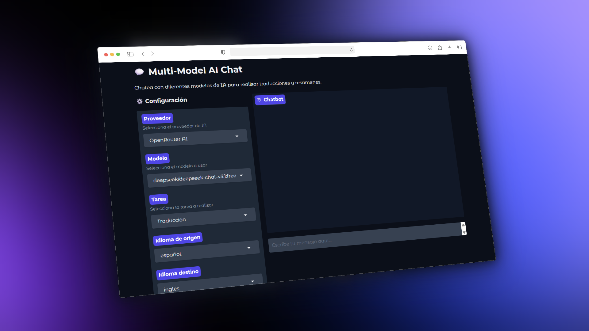

# 💬 Multi-Model AI Chat

Una aplicación de chat interactiva construida con Gradio que permite utilizar diferentes proveedores de IA (OpenRouter, Groq, Google AI) para realizar tareas de traducción y resumen de textos.

Realizada como tarea del curso de MLOps.


<!-- Inserta aquí una captura de pantalla de tu aplicación -->

---

## 🚀 Características

- **Múltiples proveedores de IA**: Soporte para OpenRouter AI, Groq y Google AI
- **Interfaz de chat intuitiva**: Conversaciones fluidas con historial completo
- **Traducción multiidioma**: Traduce entre 8 idiomas diferentes con selección de idioma origen y destino
- **Resumen de textos**: Resume textos de manera concisa y precisa
- **VQA (Visual Question Answering)**: Haz preguntas sobre una imagen y obtén respuestas breves y basadas solo en lo visible
- **Cambio dinámico**: Cambia de proveedor, modelo o tarea en cualquier momento
- **Modular y escalable**: Código bien estructurado y fácil de mantener

**Nota**: VQA requiere usar modelos multimodales (entrada de imagen). Asegúrate de escoger un modelo compatible en el proveedor elegido.
---

## 📁 Estructura del Proyecto

```
│
├── app.py                      # Punto de entrada principal
├── requirements.txt            # Dependencias del proyecto
├── .env                        # Variables de entorno (API keys)
├── README.md                   # Este archivo
│
├── config/
│   └── providers.py            # Configuración de proveedores y modelos
│
├── prompts/
│   └── tasks.py                # Definición de prompts para cada tarea
│
├── services/
│   └── ai_service.py           # Lógica de comunicación con APIs
│
└── ui/
    └── interface.py            # Interfaz de usuario con Gradio
```

### Descripción de Módulos

#### 📂 `config/providers.py`
Contiene la configuración de todos los proveedores de IA:
- URLs base de las APIs
- API keys (cargadas desde `.env`)
- Lista de modelos disponibles por proveedor
- Funciones auxiliares para obtener configuraciones

#### 📂 `prompts/tasks.py`
Define las tareas disponibles y sus prompts:
- Prompts del sistema para cada tarea
- Plantillas de mensajes para el usuario
- Lista de idiomas disponibles
- Función para generar mensajes según la tarea

#### 📂 `services/ai_service.py`
Maneja toda la lógica de comunicación con las APIs:
- Clase `AIService` que gestiona las llamadas a los modelos
- Validación de API keys
- Manejo de errores
- Procesamiento de tareas

#### 📂 `ui/interface.py`
Construye la interfaz de usuario:
- Configuración de componentes de Gradio (texto e imagen para VQA)
- Layout de la aplicación
- Eventos y funciones de actualización
- Integración con el servicio de IA

---

## 🛠️ Instalación

### Requisitos Previos
- Python 3.8 o superior
- pip (gestor de paquetes de Python)

### Pasos de Instalación

1. **Clona o descarga el proyecto**
   ```bash
   git clone <url-del-repositorio>
   cd proyecto
   ```

2. **Crea un entorno virtual (recomendado)**
   ```bash
   python -m venv venv
   
   # En Windows
   venv\Scripts\activate
   
   # En macOS/Linux
   source venv/bin/activate
   ```

3. **Instala las dependencias**
   ```bash
   pip install -r requirements.txt
   ```

4. **Configura las API keys**
   
   Crea un archivo `.env` en la raíz del proyecto con el siguiente contenido:
   ```env
   OPENROUTER_API_KEY=tu_clave_de_openrouter_aqui
   GROQ_API_KEY=tu_clave_de_groq_aqui
   GOOGLE_API_KEY=tu_clave_de_google_aqui
   ```

   **¿Dónde obtener las API keys?**
   - OpenRouter: [https://openrouter.ai/](https://openrouter.ai/)
   - Groq: [https://console.groq.com/](https://console.groq.com/)
   - Google AI: [https://aistudio.google.com/](https://aistudio.google.com/)

---

## 🎮 Uso

### Ejecutar la Aplicación

```bash
python app.py
```

La aplicación se abrirá automáticamente en tu navegador en `http://localhost:7860`

### Cómo Usar la Interfaz

1. **Selecciona el Proveedor**: Elige entre OpenRouter AI, Groq o Google AI
2. **Selecciona el Modelo**: Cada proveedor tiene modelos específicos disponibles
3. **Selecciona la Tarea**: 
   - **Traducción**: Convierte texto de un idioma a otro
   - **Resumen**: Resume textos de manera concisa
   - **VQA**: Sube una imagen y escribe tu pregunta; la respuesta se basará solo en lo visible
4. **Configura los idiomas** (solo para traducción):
   - **Idioma de origen**: El idioma del texto original
   - **Idioma destino**: El idioma al que quieres traducir
5. **Escribe tu mensaje** en el chat y presiona Enter o haz clic en "Enviar"

### Funciones del Chat

- **🔄 Reintentar**: Vuelve a procesar el último mensaje
- **↩️ Deshacer**: Elimina el último intercambio de mensajes
- **🗑️ Limpiar**: Borra todo el historial del chat

---

## 🌐 Modelos Disponibles

### OpenRouter AI
- `deepseek/deepseek-chat-v3.1:free` - Modelo DeepSeek gratuito

### Groq
- `llama-3.1-8b-instant` - Llama 3.1 de 8B parámetros (muy rápido)

### Google AI
- `gemini-2.0-flash-exp` - Gemini 2.0 Flash experimental

---

## 🔧 Personalización

### Agregar Nuevos Proveedores

Edita `config/providers.py` y agrega un nuevo proveedor al diccionario `PROVIDERS`:

```python
PROVIDERS = {
    "Nuevo Proveedor": {
        "base_url": "https://api.nuevoproveedor.com/v1",
        "api_key": os.getenv("NUEVO_PROVEEDOR_API_KEY"),
        "models": ["modelo-1", "modelo-2"]
    }
}
```

### Agregar Nuevas Tareas

Edita `prompts/tasks.py` y agrega una nueva tarea al diccionario `TASK_PROMPTS`:

```python
TASK_PROMPTS = {
    "Nueva Tarea": {
        "system": "Prompt del sistema para la nueva tarea",
        "user_template": "Plantilla del mensaje: {text}"
    }
}
```

### Agregar Nuevos Idiomas

Edita `prompts/tasks.py` y agrega idiomas a la lista `AVAILABLE_LANGUAGES`:

```python
AVAILABLE_LANGUAGES = [
    "español",
    "inglés",
    "nuevo_idioma"
]
```

---

## 📦 Dependencias

- `gradio>=4.0.0` - Framework para la interfaz de usuario
- `openai>=1.0.0` - Cliente para APIs compatibles con OpenAI
- `python-dotenv>=1.0.0` - Carga de variables de entorno

---

## 🐛 Solución a Posibles Problemas

### Error: "API key no configurada"
- Verifica que el archivo `.env` existe en la raíz del proyecto
- Asegúrate de que las API keys estén correctamente configuradas
- No olvides reiniciar la aplicación después de modificar el `.env`

### Error: "ModuleNotFoundError"
- Verifica que los archivos `__init__.py` existen en todas las carpetas de módulos
- Ejecuta `pip install -r requirements.txt` nuevamente

### La aplicación no se abre en el navegador
- Verifica que el puerto 7860 no esté ocupado
- Intenta abrir manualmente: `http://localhost:7860`
- Revisa la consola para ver mensajes de error

---
